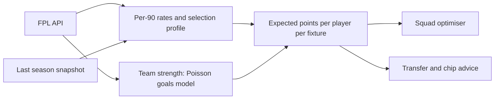

# FPL Edge

A data-driven Fantasy Premier League assistant built on the public FPL API and
the **2026/27** rules. It projects expected points for every player, builds the
best squad your budget can buy, and ranks transfers by the points they add after
any hit.

It works before a ball is kicked — projections start from last season's data and
this season's prices and fixtures — and shifts onto live results automatically as
gameweeks are played.

## SEO / deployment

Set `NEXT_PUBLIC_SITE_URL` to your production origin (no trailing slash) so
canonical URLs, Open Graph tags, `sitemap.xml` and `robots.txt` resolve
correctly. On Vercel this falls back to the project URL when unset.

## Getting started

```bash
npm install
npm run dev
```

Open http://localhost:3000. No API keys, database or configuration are needed:
everything comes from `https://fantasy.premierleague.com/api/`, fetched
server-side and cached.

| Command                    | What it does                                                    |
| -------------------------- | --------------------------------------------------------------- |
| `npm run dev`              | Development server                                              |
| `npm run build`            | Production build                                                |
| `npm start`                | Serve the production build                                      |
| `npm run check`            | Sanity-checks the model and optimiser against live data         |
| `npm run review:adjustments` | Diffs curated ease-in notes against live FPL flags            |
| `npm run typecheck`        | TypeScript, no emit                                             |
| `npm run lint`             | ESLint                                                          |
| `npm run snapshot:baseline`| Refreshes the previous-season prior in `src/data/baseline.json`  |

## What each page does

- **Dashboard** — deadline countdown, captain picks for the coming gameweek, best
  value in the game, the top five projections in every position, differentials
  under 8% ownership, and a price-change watch built from daily net transfers.
- **Players** — every player in the game with projections, underlying per-90
  rates, defensive-contribution hit rate, clean-sheet odds and a fixture ticker.
  Sortable on any column and filterable by position, club, price and start
  probability.
- **Player page** — expected points broken down rule by rule, the underlying
  rates behind them, fixture-by-fixture projections, and the player's record.
- **Fixtures** — a difficulty ticker for every club over the next few gameweeks,
  ordered by the easiest run, with the model's expected goals for and against.
- **Squad builder** — the best 15 for your budget over a horizon you choose, with
  players you can lock in or rule out, a fixed formation if you want one, and a
  chip mode (Bench Boost, Triple Captain, Free Hit, Wildcard) that retunes the
  objective for the chip week while still considering the rest of the run
  (except Free Hit, which is a one-week build).
- **My team** — enter your public FPL team ID for your recommended XI, captain,
  bench order, transfer suggestions and chip advice, with links into the builder
  preconfigured for each chip.

## 2026/27 rules

All rules live in [`src/lib/fpl/rules.ts`](src/lib/fpl/rules.ts), verified in
August 2026 against the Premier League's own announcements. Where the API
publishes a rule itself (squad size, budget, club limit, sell-on fee, chip
windows) it is read at runtime, so mid-season tweaks are picked up automatically.

**Squad and transfers.** 15 players in a 2/5/5/3 split, £100.0m budget, maximum
three per club. One free transfer a week, bankable up to five, -4 points beyond
that. Selling returns your purchase price plus half of any profit.

**Scoring.** Goals: 10 for goalkeepers, 6 defenders, 5 midfielders, 4 forwards.
Assists 3. Clean sheets 4 for goalkeepers and defenders, 1 for midfielders. One
point per three saves, 5 for a saved penalty, -1 for every two goals conceded.

**Defensive contribution.** Unchanged this season: 2 points for 10 clearances,
blocks, interceptions and tackles (defenders) or 12 of those plus ball recoveries
(midfielders and forwards), capped at 2 per match.

**Chips.** Two full sets of Wildcard, Free Hit, Bench Boost and Triple Captain.
The first set expires at the Gameweek 19 deadline and cannot be carried over.

**New this season**, and reflected in the model:

- Being tackled no longer costs BPS.
- Clearances, blocks and interceptions pay 1 BPS per three, not per two.
- Every save pays 2 BPS, plus 1 inside the box and 1 for a big chance saved; a
  saved penalty drops from 8 BPS to 7.
- Scores are provisional until lockdown, now 09:00 UK time the day after a
  gameweek's final match, with projected bonus appearing from the 20th minute.

## How the projections work



Every modelling assumption sits in [`src/lib/model/config.ts`](src/lib/model/config.ts)
with the reasoning next to it. The pieces:

**Playing time.** Start probability, typical minutes per start and substitute
appearances come from a player's own record, blended between this season and
last, weighted by how much evidence each holds. Availability comes from the
official status flag and chance-of-playing percentage.

**Injury returns.** When the FPL news carries a return date ("Expected back
15 Sep", "Suspended until 30 Aug"), availability is applied fixture by fixture:
zero (or the flagged chance) before the date, mostly restored after it. A star
who misses two gameweeks is valued for the rest of the horizon instead of being
written off entirely, which is what makes "hold or sell" calls come out right.

**Manual adjustments.** Some availability intelligence never reaches the API:
players easing back after playing the 2026 World Cup final weekend, or a
manager ruling someone out in a press conference. These live in
[`src/data/manual-adjustments.ts`](src/data/manual-adjustments.ts) as
per-gameweek start-probability factors that taper off — the shipped list covers
the England, France, Argentina and Spain contingents, who only returned to
training around 10–12 August. Half of any removed start probability comes back
as substitute appearances (a rested starter sits on the bench, not in the
stands), and goalkeepers are penalised less because they rotate far less.
Entries are matched to live FPL data by name, accent- and case-insensitively;
anything unmatched or ambiguous is skipped and reported by `npm run check`,
never guessed. `npm run review:adjustments` also flags expired windows, players
who have left the league, players FPL already lists as out, and news that changed since `src/data/adjustments-review.json`
(refresh that snapshot with `--write` after you have edited the list). Affected players show an "Eased in" badge in the tables and are
listed under fitness concerns on **My team**. Edit the file as news breaks —
no other change is needed.

**Attacking returns.** Expected goals and assists per 90, adjusted towards actual
finishing only slightly, then scaled by how much easier or harder a fixture is
than that team's own average.

**Team strength.** A Poisson goals model per fixture, driven by FPL's strength
ratings before the season and taken over by real results as they accumulate. It
gives clean-sheet probability, the expected goals-conceded deduction, and the
opponent-quality adjustment applied to attacking and save rates.

**Defensive contribution.** Qualifying actions are recomputed from their
components (so a player reclassified between seasons is scored under the right
definition) and turned into a hit probability with a Poisson threshold model.
`npm run check` validates this against published 2025/26 hit rates — the worst
error across the players checked is around 11 percentage points, and most are
within 3.

**Bonus.** Historical bonus rates were earned under the old BPS, so each player's
expectation is adjusted using their own clearance and save rates against the
2026/27 changes, with a superlinear response because bonus is a rank-order
competition inside each match.

**Blanks and doubles** need no special handling: projections iterate a team's
actual fixture list, so a blank contributes nothing and a double contributes
twice.

### Preseason versus in-season

Before the season starts, the API still carries last season's totals in
`bootstrap-static`, so the app detects preseason and treats those as the prior
rather than as current form. `src/data/baseline.json` is a snapshot of the last
completed season, keyed by each player's permanent FPL code so it survives id
changes. Refresh it once a season with `npm run snapshot:baseline`.

## How the squad optimiser works

Choosing 15 players is a multi-constrained knapsack: the budget, the 2/5/5/3
split, three per club, and a legal starting XI. Squads are scored by their best
legal XI plus a discounted bench, because a bench player only scores when a
starter does not play.

The search narrows the field to a candidate pool (best by points and best by
points per pound), builds a dozen squads from different greedy orderings, and
improves each with exhaustive single swaps and a pruned double-swap pass. The
double swaps matter: they are how the search finds "downgrade here to afford an
upgrade there". It returns the best squad found rather than a proof of
optimality, and takes well under a second.

Transfer plans use the same scoring. Every legal single transfer is evaluated;
pairs are built from the most promising singles, including ones that lose points
alone because they free up money. Plans are ranked by points gained over the
horizon minus 4 for every transfer beyond your free ones.

## Caveats

- Public team data does not expose purchase prices, so **My team** assumes selling
  price equals today's price. Your real budget may be marginally higher.
- FPL does not publish its price-change algorithm. The price watch ranks daily net
  transfer momentum, which is the input the official predictor is built on, not a
  reproduction of it.
- Players with no Premier League history are projected from the average profile of
  players priced like them in the same position, and are labelled "No history" in
  the table. Treat those as a starting point, not evidence.
- Projections describe where the odds sit. A 6-point projection is the average of
  a very wide distribution.

## Project layout

```
src/
  app/                 Routes: dashboard, players, fixtures, optimizer, my-team
  components/          UI, all presentational except a few small client controls
  lib/
    fpl/               API client, types, 2026/27 rules, season and chip state
    model/             Rates, team strength, expected points, projection assembly
    optimizer/         Best XI, squad search, transfer plans, chip advice
    view/              Slim row types for the client-side table
  data/baseline.json   Previous-season snapshot used as the model's prior
  data/manual-adjustments.ts   Hand-maintained World Cup / rotation intelligence
  data/adjustments-review.json Last FPL news snapshot for those names
scripts/
  snapshot-baseline.mjs  Regenerates the prior
  check-model.ts         Model and optimiser checks against live data
  review-adjustments.ts  Diffs curated ease-in notes against live FPL flags
```

Not affiliated with the Premier League. The FPL API is unofficial and undocumented;
if a field is renamed, the typed client in `src/lib/fpl` is the place to fix it.
